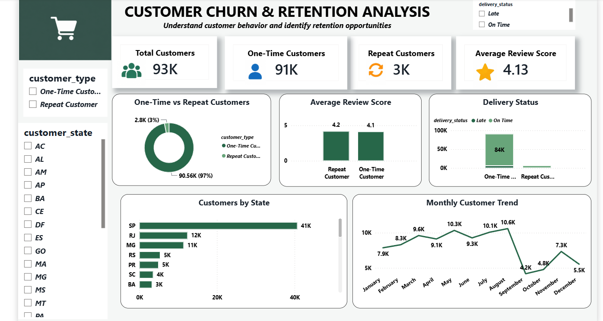

# Customer Churn & Retention Analysis

An end-to-end data analytics project focused on customer retention, one-time vs repeat customer behavior, delivery performance, and customer experience using Python, MySQL, and Power BI.

## Dashboard



## Business Problem

Customer acquisition is important, but retaining existing customers is equally important. This project analyzes customer purchasing behavior and customer experience to answer:

- How many customers are one-time customers?
- How many customers return for additional purchases?
- What percentage of customers are repeat customers?
- How does customer experience differ between one-time and repeat customers?
- Does delivery performance differ across customer types?
- Which states contribute the highest number of customers?
- How does customer activity change over time?
- Where are potential customer retention issues?

> **Note:** The Olist dataset does not contain an official churn label. One-time vs repeat purchasing behavior is therefore used as a practical proxy for retention/non-retention analysis.

## Tech Stack

- Python
- Pandas
- MySQL
- SQL
- Power BI
- DAX
- Jupyter Notebook

## Project Workflow

```text
Raw Olist Data
   ↓
Python / Pandas
   ↓
Cleaning + Preparation + Merge
   ↓
MySQL
   ↓
SQL Analysis
   ↓
Power BI
   ↓
DAX KPIs + Dashboard
   ↓
Business Insights
````

## Data

The project uses selected tables from the public Olist Brazilian e-commerce dataset.

### Customers

Contains customer and location information:

* Customer ID
* Customer Unique ID
* Zip Code Prefix
* City
* State

### Orders

Contains order and delivery information:

* Order ID
* Customer ID
* Order Status
* Purchase Timestamp
* Approved Timestamp
* Delivered Carrier Date
* Delivered Customer Date
* Estimated Delivery Date

### Order Reviews

Contains customer review information:

* Order ID
* Review Score

The three datasets were combined to create the final customer retention analysis dataset.

## Data Preparation

Pandas was used for the initial preparation:

* Removed duplicate records
* Converted date fields to proper datetime values
* Filtered delivered orders
* Merged customer and order information using `Customer ID`
* Merged review information using `Order ID`
* Used `Customer Unique ID` to identify individual customers
* Calculated order count for each customer
* Classified customers as One-Time or Repeat
* Calculated delivery delay in days
* Created delivery status
* Exported the cleaned dataset for SQL and Power BI analysis

## SQL Analysis

The cleaned data was loaded into MySQL for structured analysis.

Analysis includes:

* Total customers
* One-time customers
* Repeat customers
* Repeat customer rate
* Customer type distribution
* Average review score by customer type
* Delivery status by customer type
* Average delivery delay
* Review score distribution
* State-wise customer distribution
* Monthly customer trends
* Review score by delivery status
* Customer experience comparison
* Late delivery analysis

## Power BI Dashboard

The dashboard includes:

* Total Customers
* One-Time Customers
* Repeat Customers
* Average Review Score
* One-Time vs Repeat Customer Distribution
* Average Review Score by Customer Type
* Delivery Status by Customer Type
* Top Customer States
* Monthly Customer Trend
* Customer Type filter
* Customer State filter

## Key Results

| Metric               | Value |
| -------------------- | ----: |
| Total Customers      |   93K |
| One-Time Customers   |   91K |
| Repeat Customers     |    3K |
| Average Review Score |  4.13 |

## Key Insights

### One-time customers formed the majority

The analysis shows that one-time customers represent the large majority of the customer base, while repeat customers represent a much smaller portion.

### Repeat customers were a smaller customer segment

Repeat customers accounted for approximately 3K customers in the analyzed dataset, highlighting the importance of understanding repeat purchasing behavior.

### Customer reviews were generally positive

The overall average review score was approximately 4.13, indicating generally positive customer feedback across the analyzed orders.

### Delivery performance can be investigated alongside retention

The dashboard compares delivery status across one-time and repeat customers to identify potential patterns between delivery experience and repeat purchasing behavior.

### São Paulo contributed the highest customer volume

São Paulo (`SP`) had the largest customer count among the Brazilian states in the analyzed dataset.

### Customer activity varied across the analysis period

Monthly customer activity showed noticeable changes across the available period, providing a view of customer acquisition and purchasing patterns over time.

## Business Recommendations

* Investigate why the large one-time customer segment does not return for additional purchases.
* Analyze the customer experience of one-time customers in greater detail.
* Monitor late delivery patterns and their relationship with customer retention.
* Identify opportunities to improve post-purchase engagement.
* Analyze high-customer-volume states for targeted retention initiatives.
* Track repeat customer rate as an ongoing business KPI.

## Repository Structure

```text
Customer_Churn_Retention_Analysis/
├── README.md
├── customer_churn_analysis.csv
├── customer_churn_analysis.sql
├── Customer_Churn_Retention_Analysis.ipynb
├── Customer_Churn_Retention_Analysis.pbix
└── dashboard.png
```

## Note

This is a portfolio analytics project built from a public dataset. The analysis is intended for educational and demonstration purposes.

The project uses one-time vs repeat purchasing behavior as a practical proxy for retention/non-retention because the source dataset does not provide an explicit churn label.

